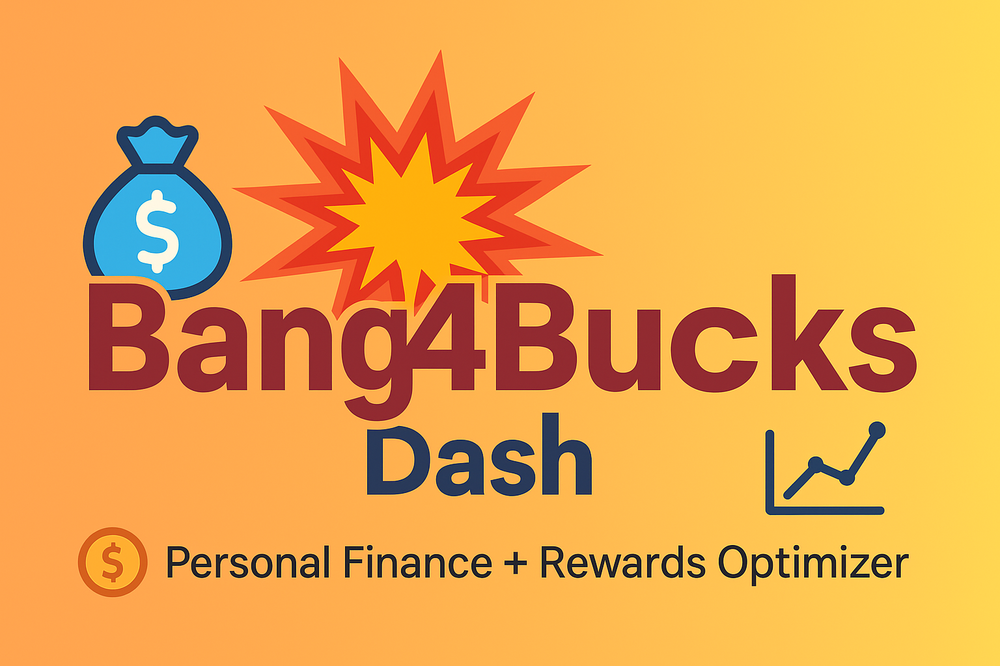

# 💥 Bang4Bucks Dash
*A Personal Finance + Rewards Optimizer App*

## Overview
Track income, expenses, rewards, investments, net worth, and debt paydown in one app. Tier-0 tools are free; Tier-1 AI/web lookups are optional (secrets needed).

## Deploy
- Upload contents to a GitHub repo named `bang4bucks-dash`
- In Streamlit Cloud: New App → repo `YourName/bang4bucks-dash` → main `app.py` → Deploy

## Enable AI (optional)
Rename `.streamlit/secrets.toml.example` to `.streamlit/secrets.toml` and add `OPENAI_API_KEY` / `RATES_API_KEY`.
